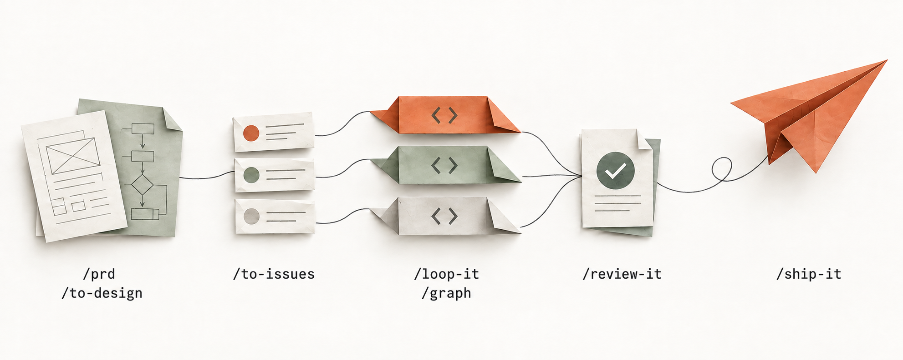

<div align="right">
  <span>[<a href="./README_EN.md">English</a>]</span>
  <span>[<a href="./README.md">简体中文</a>]</span>
</div>

<div align="center">
  <h1>let-it-go</h1>
  
  <p>A step-by-step workflow for your coding agent, from requirements to delivery.<br>
  Clarify the goal, break down the work, implement in dependency order, and ship with review and verification evidence.</p>
  <div align="center">
    <a href="https://9ashwin.github.io/let-it-go/"></a>
    
    
    
    
  </div>
  <h3>
    <a href="https://9ashwin.github.io/let-it-go/">Online docs</a> ·
    <a href="#quick-start">Install</a> ·
    <a href="#skills">Skills</a> ·
    <a href="#how-it-runs">Workflow</a> ·
    <a href="#project-status">Project Status</a>
  </h3>
</div>

## What is let-it-go?

The core of let-it-go is the 8 development-workflow skills in [`skills/flow`](skills/flow). Describe your goal, and the agent clarifies requirements, breaks down Issues, implements, verifies, and ships as the task requires.

**One work state, three profiles, no human gates.** What to change and what counts as done live in one place — the GitHub issue body (`goal` / `acceptance` / `invariants` / `unknowns` / `human_checkpoint`); how far the batch has got lives in the checkpoint. Every other document (PRD, walkthrough, PR body) is a **projection** of it. The full contract is [`skills/flow/loop-it/CONTRACT.md`](skills/flow/loop-it/CONTRACT.md).

**Not sure which entry to take? Go by shape:**

| What you have | Where it goes | Ceremony |
| --- | --- | --- |
| One sentence, and the landing plan is still yours to decide | `/prd` → `/to-issues` | The requirement is not shaped yet — settle the decisions first |
| One issue / one card / one item of a spec that fits in one context | `/loop-it` (single unit) | **Zero ceremony**: no checkpoint, no worktree, no walkthrough |
| A batch of issues with real blocking edges | `/loop-it` (serial batch) | One requirement branch + one commit per card; review and ship once at the end |
| Nodes that are genuinely parallel | `/graph` | Worktree waves + fan-in; review and ship once per wave |
| A real fork worth recording (public API / data migration / permissions / compatibility) | insert `/to-design` | Only when a dangerous surface is touched |
| A hard-to-reproduce bug / flaky test / performance regression | `/diagnose` | Get a command already red on this bug first |
| A raw inbound issue | `/triage` | Reproduce it, then make it an agent-ready card |

**A batch does not wait to be pushed.** Open a persisted goal (`create_goal`) when the batch starts, and run it to the end; **no per-issue "continue"**, and **no human review gate** — `/review-it` dispatches a subagent that does not share this context, and **gates green plus a same-layer observation for every acceptance criterion** is the release condition. A human is called exactly once: the dangerous surfaces (public API / data migration / permissions / irreversible operations).

Skills decide the steps and boundaries. Python scripts with self-tests handle ordering, layering, cycle detection, and checkpoints.

## Quick Start

### Install as a skill directory

```bash
npx skills add 9Ashwin/let-it-go
```

The skills land in `~/.agents/skills`, and this route changes nothing in any profile's dependencies.

`npx skills` scans recursively and flattens `skills/<bucket>/<skill>` into `~/.agents/skills/<skill>` — a skill root is scanned only one level deep, so the flattening is required.

> [!TIP]
> Once installed, describe what you want to do. The agent selects an entry point from the skill descriptions; name a skill when you want a specific step.
>
> The full usage guide (installation, how to trigger each step, acceptance criteria, FAQ) lives at **<https://9ashwin.github.io/let-it-go/>**.

## Set Up Your Repository

**The flow reads `AGENTS.md`; it does not write one for you.** Writing repository conventions is a human's job — the universal red lines are already the flow's own defaults (no force-push, no committing credentials, the default branch only via PR, never weakening a frozen test to get green), and repository-specific dangerous surfaces are caught by `human_checkpoint` at the moment they are touched (public API / data migration / permissions / irreversible operations).

To make it more certain, put these — the things it cannot scan — in the repository-root `AGENTS.md`:

| Write it down | Notes |
|---|---|
| **Gate** | The command that must stay green: `make check` · `go build ./... && go test ./...` · `pnpm lint` · `mise run check`. Without it the flow scans the Makefile / `package.json` / `go.mod` / `.github/workflows` itself |
| **Acceptance baseline** | Which tests are frozen, and where new tests go. Left undeclared, appending to an existing test file can read as weakening it |
| **Scope root** | Only if the repo already has a requirement-directory convention (`requirements/<scope>/`); otherwise leave it out and the skills use their own default |
| **Red lines** | The repository's non-negotiable bottom lines. Write "none yet" if there are none |

**A convention that is not written into `AGENTS.md` does not exist for the flow** — it can only read what is in the repository. There is no need for `RULES.md` / `CONSTRAINTS.md`-style registers: they need a maintainer to avoid rotting, and a rotted convention is worse than none.

## How It Runs

Parallel tasks are implemented by node and shipped by wave; serial tasks are wrapped up as a batch. A node is an implementation subagent in its own worktree, and a wave is a group of nodes that can run together.

| Scope | Does | Doesn't |
| --- | --- | --- |
| **Node** | Implements in its own worktree, proves itself with the project's gates, and **only commits to its own branch** | No push, no PR, no merge, no self-review |
| **Wave** | Leak check → merge only the nodes that finished → run gates on the integrated tree → **review once** (one section per node, focused on the seams between nodes) → **ship once** (writes the walkthrough first - evidence only: what changed, what was run, what it proved - then the PR body and merge checklist, produced here and nowhere else; one PR with a per-item evidence table) | No node-level PRs; no per-node walkthrough |
| **Batch** | `/loop-it` implements and commits one Issue at a time, inline or through an implementation subagent; review strength follows the **dangerous surface** (concurrency / auth boundary / shared interface); delivery - walkthrough included - happens once at the end | No skipping the final review; no per-Issue PRs |

A few deliberate design choices:

- **Use `/graph` only when there is real parallelism.** One unit, two units that share a file, or chained work like "schema → API → UI" belongs in `/loop-it` or done inline — all of `/graph`'s value comes from nodes within a wave being genuinely independent.
- **A single-node wave skips the wave branch.** There is nothing to integrate, so that node's branch goes straight to review and shipping.
- **Failed nodes are retried in place first.** A follow-up message reuses that node's own context instead of paying for a fresh child; if the retry still fails, the node is re-run, and if it fails again it is dropped from the wave branch — its siblings were independent all along, so the rest ship as usual.
- **When one PR closes several Issues, list the evidence per item**: the commit, the Issue it closes, the test names that prove it, and the manual acceptance status. After a squash those commits are invisible on `main`, and without this table there is no way to roll back or audit one Issue on its own.

## Why let-it-go

- **Cost is counted per wave, not per node.** Every subagent pays for the parent's system prompt, tool schemas, and skill catalog across its entire lifetime, and a `/review-it` + `/ship-it` per node means N PRs, N CI runs, and N chances to get stuck on a merge conflict. So nodes stop at commit, and review and shipping are collected at the wave level.
- **The arithmetic lives in scripts.** Dependency ordering, wave layering, scope-conflict serialization, and the checkpoint state machine all ship with the skills under `skills/<bucket>/<skill>/scripts/`, each with self-tests (the repo-root `scripts/` holds only the maintenance scripts: `check_skills.py` and `sync_vendor.py`); the skills describe when to use them and where the boundaries are, not how the algorithm works.
- **Designed around real constraints, not an idealized model.** Subagents have no cwd of their own, every shell call is a fresh shell, delegation depth is capped, and the skill catalog is billed to every subagent — all of which became hard rules in the skills (absolute-path discipline plus leak checks against the shared checkout, nodes may not spawn further subagents, and an optional [lean-subagent patch](skills/flow/graph/references/lean-subagent.md)).

## Skills

The project centers on [`skills/flow`](skills/flow). Names below use the `/` prefix (DSH); each links to the full instructions.

| Skill | Responsibility and boundary |
| --- | --- |
| [`/prd`](skills/flow/prd/SKILL.md) | Clarify goals, scope, and open questions, then define verifiable acceptance criteria |
| [`/to-design`](skills/flow/to-design/SKILL.md) | Write a design proposal when the approach and tradeoffs need to be explicit; Markdown is the main artifact, HTML an optional rendering |
| [`/to-issues`](skills/flow/to-issues/SKILL.md) | Split work into vertical slices, with implementation contracts, acceptance criteria, required evidence, and blocking dependencies in each Issue |
| [`/loop-it`](skills/flow/loop-it/SKILL.md) | The implementation entry point: finish single tasks inline or run dependent batches serially, with resumable checkpoints and review intensity matched to batch size |
| [`/graph`](skills/flow/graph/SKILL.md) | Run genuinely parallel tasks in dependency waves, with a worktree per node, evidence checks at fan-in, and review and delivery once per wave |
| [`/review-it`](skills/flow/review-it/SKILL.md) | Assess requirement compliance (Spec) and code standards (8 dimensions), reporting the two axes separately |
| [`/ship-it`](skills/flow/ship-it/SKILL.md) | Take finished work to "PR ready": write the walkthrough (the human-readable projection of the recorded observations), then commit, push, open the PR and post the implementation summary. **Stops there** - merging goes to a human |
| [`/merge-it`](skills/flow/merge-it/SKILL.md) | Merge a PR that is already open: lay out what is being merged and the check status, merge, close the Issue, sync the default branch. **Only a human can invoke it** - merging is irreversible |

<details>
<summary>Supplementary skills collected for personal use</summary>

`skills/bonus` and `skills/vendor` contain tools the author collected for personal use. They remain in the repository for use as needed; the project's focus and main workflow are in `skills/flow`.

| Directory | Contents |
| --- | --- |
| [`skills/bonus`](skills/bonus) | `/conflict`, `/diagnose`, `/modern-go`, `/refactor`, `/test-first`, `/triage`, `/understand`: conflict resolution, diagnosis, code quality, testing, triage, and change explanations |
| [`skills/vendor`](skills/vendor) | `/find-skills`, `/frontend-design`, `/humanizer-zh`, `/pptx`, `/resume-optimizer`, `/skill-creator`, `/svg-diagram`, `/teach`, `/ui-ux-pro-max`, `/web-design-guidelines`: tools for skill management, design, writing, presentations, resumes, and diagrams |

The repository contains 25 skills in total: 8 core and 17 supplementary. Of these, 23 support automatic selection by description; `/teach` and `/merge-it` retain `disable-model-invocation` and require manual invocation. Skills in `vendor` are verbatim upstream copies; see each directory's `NOTICE.md` for source, version, and license.

</details>

## Repository layout

```
skills/
├── flow/          # the PRD → ship workflow, used as the task requires (8)
├── bonus/         # supplementary engineering tools collected for personal use (7)
└── vendor/        # personal collection of upstream copies, pinned by the manifest (10)
scripts/           # check_skills.py (layout / frontmatter / cross-refs / patch)
                   # sync_vendor.py (vendor sync and additions)
Makefile           # the entry point for make check / test / vendor-*
cordis.patch.yml   # the DSH bundle patch: each of the three buckets is its own customSkillDirs root
```

`flow` is the project's core workflow; `bonus` and `vendor` are supplementary personal collections. `vendor` is synced verbatim from upstream, with a `NOTICE.md` in each directory recording its source, commit, license, and sync date.

## Maintenance

```bash
make check          # layout, frontmatter, cross-references, bundle patch
make test           # check first, then the bundled scripts' self-tests
make vendor         # copy every vendored skill in at its pinned commit
make vendor-check   # report vendored skills whose upstream has moved
make vendor-update  # re-pin to upstream HEAD, sync, and validate
make vendor-list    # list vendored skills and the commit each is pinned to
make vendor-add URL=<git url> SKILL="name [name...]"   # add new ones (the shape of npx skills add <url> --skill <name>)
```

`skills/vendor/vendor.json` is the manifest; each skill records `source` / `sourceUrl` / `path` / `ref` (pinned to a commit) / `license`. **Everything under `skills/vendor/` is a verbatim copy — never edit it in place**; change the manifest and run `make vendor`.

## Project Status

    

## Community & Feedback

- 🌐 [**Online docs**](https://9ashwin.github.io/let-it-go/) — usage guides in Chinese and English
- 🐛 [**Issues**](https://github.com/9Ashwin/let-it-go/issues) — bugs, feature requests, and skill improvements

## License

MIT — see [LICENSE](./LICENSE).
